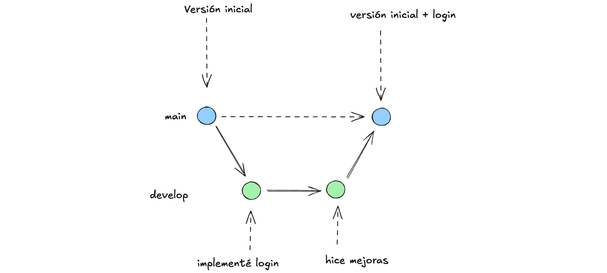

# Git

Git es una herramienta para gestionar versiones de un proyecto, principalmente para programadores.

## Conceptos importantes

- **Branch (rama):** Es el nombre que se asigna a una nueva versión del codigo original, se considera una ramificiación de la primera versión.

  - **main:** Es la rama principal donde se debe tener unicamente versiones finales de un desarrollo
  - **develop:** Es la rama secundaria donde se debe utilizar para compartir versiones casi terminadas con el equipo

- **Commit (proteger):** Es el codigo (hash) asignado a un conjunto de cambios. Se le puede decir que protegemos los cambios realizados y se guardan en la historia de git.

- **Merge (fusionar):** Es un commit que contiene el consolidado de todos los cambios. Se le puede decir que fusiona cambios entre ramas.

- **Clone (clonar):** Es la descarga que se realiza del codigo fuente de un proyecto que incluye el historico de commits. Se le dice clonar por que es una copia identica al proyecto original.

## Poniendo en practica nivel 1

Para empezar a trabajar hay que conocer el flujo basico de trabajo, se describe en la siguente imagen.

1. La forma mas simple es utilizar herramientas que nos ayude a entender como trabajar en equipo, entre muchas herramientras yo prefiero utilizar [Sourcetree](https://www.sourcetreeapp.com/).

